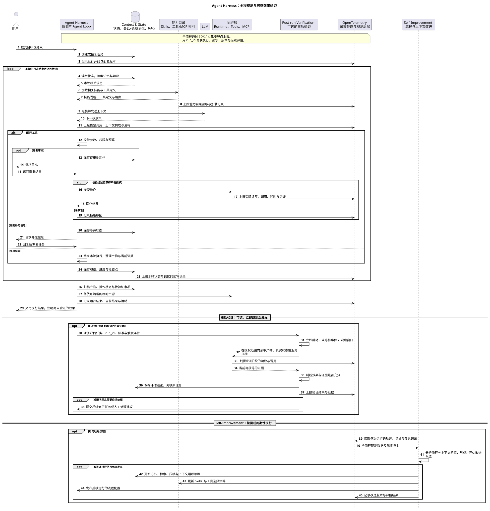

# 一、背景
## 大模型：预测下一个文字（token）
### **世界知识的参数化压缩**
在预训练阶段，系统以海量文本为训练集，通过最小化交叉熵损失（Cross-Entropy Loss），利用反向传播算法计算梯度并迭代优化网络权重，将非结构化的世界知识内化沉淀为模型的隐式参数记忆；在推理生成阶段，模型结合当前对话的上下文窗口，驱动底层参数权重，前向传播，自回归地预测并生成下一个 Token。

### 自回归条件概率预测
生成式 LLM，基于模型的权重、给定输入上下文以及已生成的词元序列，模型**为词表中的各个候选词元分配概率**，得到下一个词元的条件概率分布：

```math
P_{\theta}(x_t \mid C, x_{\lt t})
```

其中：

+ $`\theta`$：模型通过训练学习到的参数。
+ $`C`$：当前输入上下文，例如系统指令、用户问题或工具返回结果。
+ $`x_{\lt t} = (x_1, x_2, \dots, x_{t-1})`$：当前输出中已经生成的词元序列。
+ $`x_t`$：即将生成的下一个词元。

### token解码
**随后，解码器根据该分布选择或采样下一个词元。以 Top-k 采样为例，先保留概率最高的 k 个候选词元，再将它们的概率重新归一化，并按该概率分布随机采样，得到 $`x_t`$。候选词元被选中的概率通常并不相等。** 

| 候选词元 | 原始概率 | 是否保留 ($`k=3`$) | 重新归一化后的概率 | 实际抽中机制 |
| :--- | :--- | :--- | :--- | :--- |
| **公园** | 40% | 保留 | $`40\% \div 75\% \approx \mathbf{53.3\%}`$ | 概率最高，超过一半几率被选中 |
| **散步** | 25% | 保留 | $`25\% \div 75\% \approx \mathbf{33.3\%}`$ | 概率次之，有三分之一几率被选中 |
| **跑步** | 10% | 保留 | $`10\% \div 75\% \approx \mathbf{13.4\%}`$ | 概率最低，仍有少量几率被选中 |
| 睡觉 | 5% | 丢弃 (不在 Top-3) | 0% | 不参与抽样 |
| ...其他词 |    共 20% | 丢弃 (不在 Top-3) | 0% | 不参与抽样 |


**新生成的词元被加入上下文，模型继续预测下一个词元，如此循环，直至生成结束标记或满足其他停止条件。**

## **能力具身：文字转化为行动（@tool 与 MCP）**
大模型将自然语言决策转化为结构化参数，再借由工具真正落地执行：

+ `**@tool**`**（本地代码）**：模型直接调用当前程序内的本地函数，快速简单。
+ `**MCP**`**（标准协议）**：Anthropic 推出的开放协议，充当标准桥梁，统一调度外部数据库、沙箱或第三方服务的工具。

## 动态编排：指导行动的 Agent Loop（感知—推理—执行闭环）
任务通常需要分步推进，而下一步如何行动，往往取决于上一步的执行结果。Agent Loop 将感知、推理与执行组织成反馈闭环，使 Agent 能够根据新信息调整行动，逐步完成任务。

参考 [ReAct](https://arxiv.org/abs/2210.03629) 中推理与行动交替进行的思路，可将循环概括为：

1. **Observe（感知）**：获取任务目标、当前状态与最新环境信息。
2. **Think（推理）**：分析当前状态与目标的差距，选择下一步行动，或判断是否满足完成条件。
3. **Act（行动）**：模型生成工具调用请求，由 Agent Harness 校验并调度工具执行。
4. **Feedback（反馈）**：将执行结果或错误信息整理后纳入上下文，更新任务状态，为下一轮决策提供依据。

**控制策略**：可按需引入状态机（FSM）管理流程，通过反思与经验记录（如 [Reflexion](https://arxiv.org/abs/2303.11366)）和动态重规划（Replanning）调整后续行动，降低错误累积和无效重复的风险。

**停止条件**：当任务达到完成标准、步数或时间预算耗尽，或出现不可恢复的错误时，结束循环并返回结果或当前进度。

### 生产级底座：Agent Harness（支撑长任务的可靠运行）
Agent Harness 是支撑 Agent 运行的工程框架，通常承载 Agent Loop，并提供上下文、状态和执行管理，确保复杂长任务能够持续推进、并在异常时安全中断与恢复。

LLM 可能产生事实错误、错误判断或不当的操作请求。当这些请求被外围程序解析并交给工具执行时，错误就可能影响文件、数据库或外部服务。****

Agent Harness 的主要职责包括：

+ **上下文与状态管理**：组织上下文，保存任务进度和检查点，支持中断恢复。
+ **权限与执行控制**：限制工具访问范围，按策略审批敏感操作。
+ **故障与资源管理**：处理超时、失败与受控重试，限制执行时间和调用预算。
+ **验证与追踪**：依据任务完成标准检查结果，记录执行轨迹，支持问题排查。

**Agent Harness 无法彻底消除幻觉，但可以通过外部检索、规则校验、独立验证和必要的人工审批，降低模型错误及其对真实系统的影响，并保留状态与记录，支持后续修正。**

# 二、Agent Harness架构
Agent 的核心在于根据上下文动态组装 SOP，进而提取参数并调度工具与技能；而 Agent Harness（对应chatGPT等的work模式） 则是保障这一过程的运行底座，负责让 Agent 运行得更持久（长程状态管理）、更安全（权限与沙箱控制）、更可控（确定性编排与容错），即使，超长时间和链路执行，也能和用户的问题对齐。

<!-- 这是一张图片，ocr 内容为：POST-RUN VERIFICATION AGENT HARNESS 5 NEW AGENT LOOP RUN SEVEN CORE COMPONENTS INPUT:VERIFICATION TASK DEFINED BY PREVIOUS AGENT LOOP GOAL & RESULT CHECK SIDE-EFFECT & DIFF AUDIT APPROVAL/POLICY COMPLIANCE TASKS & VALIDATION OUTPUT &ARTIFACT INTEGRITY SOURCE / CITATION VERIFICATION PASS FALLDIAGNOSERETRYRE-PLAN VERIFIED RESULT FEEDBACK LIVE RUN AGENT LOOP REACT:REASON > ACT OBSERVE ~ (OBSERVATIONS & RESULTS) ACTIVITY PLANNING LLM: SUBMIT ASSEMBLE CONTINUE/ LNSPECT TASK/ REASON & PLAN STOP CONTEXT OPERATION OBSERVATION OUTPUTS RETRIEVING CONTEXT INTENT USER/ DECIDE WHAT TO OBSERVE, EMIT PLANNED ASSEMBLE TASK,MEMORY REVIEW RESULTS, APPLY LLM DECISION: SUBAGENTS GETTING APPROVAL TOOL TASK OBSERVATION AND PLAN ACTIONS & AVAILABLE EVENTS,OR ERRORS CONTINUE OR FROM RUNTIME VERIFYING RESULT ACTION REQUESTS AND CHOOSE NEXT STEPS OBSERVATIONS CONCLUDE SOURCES FINISH DECISION CONTINUE<REBUILD CONTEXT ENVIRONMENT / CONTEXT READ OBSERVATION`RESULT OPERATION REQUEST STATE SNAPSHOT/EVENTS TOOLMCPSHELL EVENT ERROR ARTIFACT CONTEXT & STATE MEMORY 4 AGENT RUNTIME - SANDBOX EXECUTION ENVIRONMENT TOOLS (ACTION) WORKNG MEMORY ROUTE OPERATION GATEWAY / DISPATCHER READ/WRITE TASK/ TODO STATE PROPOSED ACTION LONG-TERM MEMORY TOOL APPROVAL FILE MERNORY AND FILE ACCESS PRE-OPERATIONAL HISTORY PERSISTENCE SHADOO EPHEMERAL ISOLATED WORKSPACE TOKEN BUDGET CONTEXT ASSEMBLY COMVERSATION ISOLATED FILESYSTEM & MOUNTS 我可20 /Y BACKGROUND AGENTS PROCESS & SHELL EXECUTOR RAG CHUNK &EMBED SOURCES VECTOR STORE APPROVAL/DENIAL SHELL COMMAND MCPAPI TOOL/MCP EXECUTOR TIMEOUT  CANCEL `CLEANIUP RETRIEVE TOP K CONTEXT INGESTION ACTION RESUTT 0-0-G大E NETWORK ACCESS POLICY LOCAL METHOD EXECUTION WEB SEARCH STDOUT STDERR` SECRETS BOUNDARY INVOCATION MCP & SKILLS CONTRACT EXIT STATUS ARTIFACTS CPU`MEMORYTIME LIMITS MCP REGISTRY AGENT SKILS DISCOVERY&RANKING TOCL/METHOD SCHERNAS GYQUAN SELF-IMPROVEMENT OPEN TELEMETRY (OBSERVABILITY) AGGREGATED ANALYZE OPENTELEMETRY SIGNALS ONLY TELEMETRY SIGNALS APPROVED CONTEXT UPDATES LOGSMETRICS OPTIMIZE CONTEXXT(PROMPT MEMORY `RETRIEVAL) TOOL SPANS TRACES PROMPT * MEMORY * RAG * SKILLS OPTIMIZE AGENT LOOP WORKFLOW TOKENS LATENCY EVENTS EVALUATEAPPROVERSION ROLL BACK -->


## 1. Context（上下文管理体系）
上下文工程决定 Agent 的决策质量与推理成本。

+ **Build Context（动态构建）**：每次请求 LLM 前，根据当前 State 动态裁剪和拼接 Prompt，控制上下文长度（必要时压缩）、提高缓存命中率（Token Window、Message Window、Cache Hit Rate 等）。

可以将 Context 细分为两个维度：

### 1.1 短期上下文（Session & State）：当前会话
+ **Conversation & State**：当前会话的历史记录（工具返回、Skill 加载内容、用户输入等），以及 Agent Loop 处于哪个具体阶段，例如：正在思考、正在等待工具返回、正在纠错。
+ **MCP（Model Context Protocol）& Skill Metadata**：当前 Agent 被授权使用的工具描述集、API Schema，以及预定义的 Skill 列表。

### 1.3 长期记忆（Cross-Session Memory & Knowledge）：跨会话
+ **长期记忆**：用户偏好、历史交互习惯、核心事实提取，通过向量数据库或图数据库等持久化。
+ **知识库（RAG）**：垂直领域的专业知识（文档、业务规则），作为外部大脑，在需要时被检索并注入上下文。

## 2. Agent Loop（核心推理循环）
这是 Agent 的“大脑”，负责动态编排流程和参数拼凑。

### 2.1 宏观策略（Plan and Execute）
将复杂目标拆解为多步子任务（Sub-tasks），维护一个全局的执行计划（To-Do List），并根据执行情况动态调整。

### 2.2 微观执行（Observe, Think, Act）
针对每一个子任务，执行 ReAct（Reasoning and Acting）循环：

1. **Think**：评估当前状态，决定下一步需要调用什么工具，或者是否已经可以得出结论。
2. **Act**：实时拼凑请求参数，发起动作，例如生成代码、调用 API 等。
3. **Observe**：获取动作的执行结果，作为下一步 Think 的输入。

## 3. Agent Runtime（运行时与沙箱）
由于 Agent 具有非确定性（Non-deterministic）和不可靠性（可能会生成破坏性指令或幻觉），必须将其执行与核心业务系统物理或逻辑隔离，对 Agent 的运行安全性进行兜底控制。

+ **执行隔离（Sandbox）：**工具的实际执行，尤其是生成的代码执行、Shell 脚本运行，必须放在严格受限的沙箱环境中，例如一次性 Docker 容器等。
+ **权限控制（PoLP）：**遵循最小权限原则，Agent 只能访问当前任务绝对需要的网络、文件和 API，防止越权操作或数据泄露。

## 4. Tools & Action（工具与执行控制）
LLM 只是输出结构化的意图，实际的执行由底层设施完成。

+ **MCP Server 集成：**通过 Model Context Protocol 将本地或远程的工具标准化。Agent 输出结构化参数（如 JSON），MCP Client 解析并路由给对应的 MCP Server，进行实际执行和结果拼装。
+ **无缝解耦：**Agent 只需要知道工具的描述和入参要求，无需关心底层鉴权、网络重试和协议转换，这些由 Agent Harness（外壳框架）处理。
+ **动作合法性、安全与熔断控制：**由于大模型具有非确定性，可能产生幻觉或越权指令，在动作真正下发至底层系统前，Harness 层必须提供强有力的兜底与校验机制。
    - **静态约束拦截（Pre-execution Validation）**：对 LLM 构造的参数进行 Schema 校验，例如类型检查、必填项断言、越界检查。对于不合法参数，进行拦截或者要求 LLM 重新生成，避免错误向外透出。
    - **破坏性行为熔断（Destructive Action Circuit Breaker）**：对高危操作引入“人工确认”，极端情况下，或者要暂时熔断高危工具对外界的可见性、可用性。

## 5. Post-Run Verification（执行后验证机制）
Agent 操作生效的结果验证可能具有滞后性或不确定性。

+ **异步状态回溯：**某些操作需要一段时间才能确认最终结果。Agent 框架需要具备异步轮询或事件监听（Webhook）机制。
+ **结果校验（Critic / Guardrails）：**引入独立的轻量级“监督 Agent”或硬编码的规则引擎，对执行结果进行二次验证。如果不符合预期，则将错误信息反馈给核心 Agent，触发重试逻辑。

## 6. Observability（可观测性 — OpenTelemetry）
Agent 本质上是在动态编排流程并实时拼凑请求参数，因此传统的静态监控不够用，需要观察每一次的执行轨迹（Trace）。观测内容其实可以分为**客观指标以及业务指标。**

### 6.1 客观指标（Metrics & Traces）
+ **执行轨迹（Tracing）**：主要记录 Agent 动态编排的流程。记录 Plan 拆解的每一步、ReAct 循环的具体层级和耗时（跨度 / Span），定位在哪一步发生了死循环、逻辑断层或者局部无效的编排。
+ **实时请求状态（Payload Logging）**：记录每次调用 LLM 的完整 Prompt、实际拼凑的 Tool Arguments，以及工具返回的 Raw Response。
+ **性能与成本（Metrics）**：Token 消耗统计（按阶段或工具维度拆分）、LLM 接口延迟（TTFT、生成耗时）、工具执行成功率与失败率。
+ **幻觉与错误识别（Error Tracking）**：工具参数格式化错误（JSON 解析失败）的频率、触发 Post-Run 修正的次数。

## 7. Self-Improvement（自进化与优化）
将高频且验证可靠的动态行为沉淀为静态资产，降低系统的不确定性和成本。

+ **常用流程 → Workflow（工作流）**

如果发现 Agent 在处理某类任务或者某些局部执行时，总是遵循固定的 Observe–Think–Act 路径，系统应将其固化为确定性的 Workflow（如 DAG 任务流），跳过 LLM 的动态推理，直接执行。

+ **提取 Skill（技能组件）**

将一组常用的“局部流程编排 + 工具参数组成”打包成一个高阶 Skill。当下次遇到类似意图时，Agent 可以直接调用这个 Skill，减少多步推理带来的幻觉风险、耗时、以及错误。

<!-- 这是一张图片，ocr 内容为：回退 首次选错 后续调用SKILL 改选 继续执行 SKILL固化正确局部链路 相同条件下直接复用 -->


+ **优化提示词**：包括重新生成问题、修正skill、系统提示词等

## 流程图


# 三、Agent使用场景
+ 使用AI、或者使用Agent去完成、简化工作流程，等于在流程中注入灵活性，同时引入不可靠性
+ 是什么情况下需要注入灵活性：
    - 规则无法穷举
    - 信息在不同形式间转换：自然语言转代码/SQL、多模态解析、长文本提炼结构化参数等
    - 动态渐近探索：下一步的决策依赖于上一步工具的实时反馈；SOP流程复用率极低，编排成本高
+ 如何控制“不可靠性”（错误成本）：大模型按概率预测token，步骤越多、出错率呈指数累加
    - 在“事前”环节引入agent能力：做“草稿态”，不做“终审者”，例如使用ai生成草稿态营销配置等
    - 容忍偶发错误决策：追求统计平均的胜率（9/10），错误可以快速检测出，并进行干预

# 四、Agent、multiAgent和workFlow
## 4.1 multiAgent
当复杂任务可以拆解为职责清晰、相对解耦的子任务时，适合采用Multi-agent架构。未来必定是multi-agent作为主流，因为Agent Harness work模式，执行实在是太慢了。

常见的组织模式包括：

+ 异构协作（Specialized Agents）：不同Agent分配不同SystemPrompt，database，tools以及skills，各司其职地协作完成复杂目标
+ 同构扩展探索（Parallel Instances）：基于统一定义的Agent启动多个实例，针对不同维度或研究方向并行探索（不同UserInput、多源深度调研），最终由上层聚合提炼结果（Fan-out / Map-Reduce 模式）

## 4.2 Sub-Agent
+ Sub-Agent是一种特殊的multi-agent架构
+ 子Agent运行在相互隔离的上下文窗口，专注执行局部任务并返回结构化产出，防止上下文污染、注意力分散
+ 主子Agent的“从属关系”核心体现为任务委派和汇报契约，主Agent统一最终结果整合与质量把控

## 4.3 选型决策：Agent还是Workflow
+ 适用Workflow场景：
    - 任务边界清晰、步骤固定、具有**强周期性。**工作流通过代码硬编码确定性执行图（DAG），最大化系统可靠性、低延迟与低成本。
+ 适用Agent场景：
    - 需要模型自主掌控控制流，通过推理决策应对复杂不确定性，动态自主编排流程。任务具有高开放性、执行路径无法预设，动态实时调整。

# 五、Agent的集成方式：集中式服务与应用内嵌

这里比较的是 Agent 与业务应用的集成边界：**集中式服务**是将 Agent 作为独立服务，供业务应用调用；**应用内嵌**是让 Agent 的编排逻辑随业务应用一起部署。这与模型在本地还是远程运行并不等同。

“平台”和“框架”属于工具与产品层面的区别，不能直接对应这两种集成方式：用框架编写的 Agent 可以部署为集中式服务，平台也可以部署在企业内部。

## 5.1 集中式服务：多个业务复用，统一管理

当多个业务需要复用同一能力，且任务的输入输出与授权边界较清晰时，可以优先考虑集中式服务。需要统一模型接入、运行观测和成本管理，或希望独立扩容、处理异步长任务时，也适合考虑这种方式。

例如，客服、销售和运营共用知识检索、文档分析与报告生成能力，各业务通过接口提交任务并获取结果。

它的优势是**能力复用与统一治理**；代价是跨服务交互，以及适配公共接口、权限和任务流程的成本。它既可用于探索，也可长期承载稳定的业务能力。

## 5.2 应用内嵌：贴近业务状态与规则

当 Agent 主要服务单个业务，频繁依赖该业务的内部状态、权限、规则和已有代码，而且 Agent 逻辑需要随业务版本一起演进时，可以优先考虑应用内嵌。

例如，营销配置助手读取用户当前编辑的草稿，调用业务已有的内部校验，再把建议写回草稿。

它的优势是**便于业务集成和细节控制**；代价是业务团队需要承担更多工程建设与维护责任。同进程运行可能减少部分数据中转，但不保证模型推理更快、上下文零拷贝，也不会自动获得更强的容灾能力。

## 5.3 如何选择与组合

一个实用判断是：任务能否通过清晰接口交给独立服务，业务拿到结果后即可继续推进。

+ 如果可以，而且多个系统需要共用，倾向于集中式服务。
+ 如果需要频繁往返业务内部细节，难以形成稳定接口，倾向于应用内嵌。

这只是经验判断，需要结合实际约束取舍，并非硬性限制。两种方式也可以组合：**模型接入、运行观测与成本治理等通用能力集中提供，贴近业务的编排和规则留在业务应用内。**


